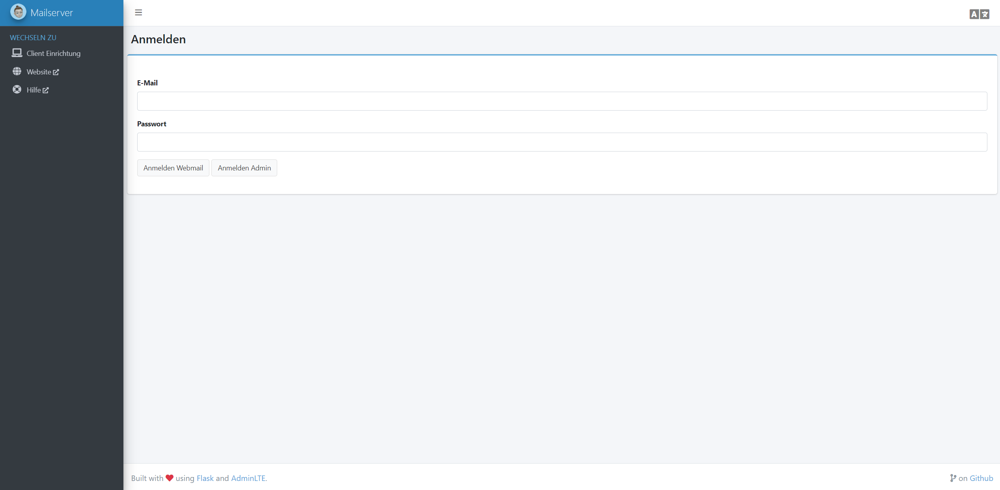

# Mailserver

This example creates a [Mailu](https://mailu.io/) mailserver with antivirus, antispam, roundcube webmailer, admin interface, multiple hosts/domains and more.



::: warning Server requirements
In order to smoothly run the mailserver, its recommended that you have at least 3GB of RAM. You can remove the antivirus service in the `docker-compose.yml` in step 1 to reduce the required memory to 1GB. Although this is not recommended due to security reasons.
:::

::: warning Make the example your own
In general you don't have to change anything in the below example to make it work for you. However, we highly recommend to take a closer look to the lines marked with a `TODO: CHANGE ME` comment.
:::

## Installation

### Step 1: Create a `docker-compose.yml` file

All data that needs to be persisted will be mount to the `./mailu` folder. So if you need to back up the mailserver, you can simply backup this folder.

```yaml
version: "3"

services:
  # External dependencies
  redis:
    image: redis:7-alpine
    restart: always
    volumes:
      - "./mailu/redis:/data"
    depends_on:
      - resolver
    dns:
      - ${DNS}

  postgres:
    image: postgres:14-alpine
    restart: always
    environment:
      POSTGRES_DB: "${DB_NAME}"
      POSTGRES_USER: "${DB_USER}"
      POSTGRES_PASSWORD: "${DB_PW}"
    volumes:
      - ./mailu/postgres:/var/lib/postgresql/data
      # create 2nd database for webmail:
      - ./docker_postgres_init.sql:/docker-entrypoint-initdb.d/docker_postgres_init.sql

  # Core services
  front:
    image: mailu/nginx:${MAILU_VERSION:-1.9}
    restart: always
    env_file: .env
    logging:
      driver: json-file
    ports:
      - "25:25"
      - "465:465"
      - "587:587"
      - "995:995" # POP3S (secure), do not use port 110 for POP3 because its insecure
      - "143:143"
      - "993:993"
    volumes:
      # path to cert folder
      - "./certs:/certs:ro"
      - "./mailu/overrides/nginx:/overrides:ro"
    environment:
      # nginx proxy will request cert for all hostnames in a single cert
      # so the cert runs under the name of the first hostname and includes all other hostnames
      # so only the first cert has to be mounted in volumes to /certs
      VIRTUAL_HOST: "${HOSTNAMES}"
      LETSENCRYPT_HOST: "${HOSTNAMES}"
    depends_on:
      - resolver
    dns:
      - ${DNS}
    networks:
      - default
      - nginx-proxy

  resolver:
    image: mailu/unbound:${MAILU_VERSION:-1.9}
    env_file: .env
    restart: always
    networks:
      default:
        ipv4_address: ${DNS}

  admin:
    image: mailu/admin:${MAILU_VERSION:-1.9}
    restart: always
    env_file: .env
    environment:
      INITIAL_ADMIN_DOMAIN: "${DOMAIN}"
      INITIAL_ADMIN_MODE: ifmissing
    volumes:
      - "./mailu/data:/data"
      - "./mailu/dkim:/dkim"
    depends_on:
      - redis
      - postgres
      - resolver
    dns:
      - ${DNS}

  imap:
    image: mailu/dovecot:${MAILU_VERSION:-1.9}
    restart: always
    env_file: .env
    volumes:
      - "./mailu/mail:/mail"
      - "./mailu/overrides/dovecot:/overrides:ro"
    depends_on:
      - front
      - resolver
    dns:
      - ${DNS}

  smtp:
    image: mailu/postfix:${MAILU_VERSION:-1.9}
    restart: always
    env_file: .env
    volumes:
      - "./mailu/mailqueue:/queue"
      - "./mailu/overrides/postfix:/overrides:ro"
    depends_on:
      - front
      - resolver
    dns:
      - ${DNS}

  antispam:
    image: mailu/rspamd:${MAILU_VERSION:-1.9}
    hostname: antispam
    restart: always
    env_file: .env
    volumes:
      - "./mailu/filter:/var/lib/rspamd"
      - "./mailu/overrides/rspamd:/etc/rspamd/override.d:ro"
    depends_on:
      - front
      - resolver
    dns:
      - ${DNS}

  # Optional services
  antivirus:
    image: mailu/clamav:${MAILU_VERSION:-1.9}
    restart: always
    env_file: .env
    volumes:
      - "./mailu/filter:/data"
    depends_on:
      - resolver
    dns:
      - ${DNS}

  fetchmail:
    image: mailu/fetchmail:${MAILU_VERSION:-1.9}
    restart: always
    env_file: .env
    volumes:
      - "./mailu/data/fetchmail:/data"
    depends_on:
      - resolver
    dns:
      - ${DNS}

  # Webmail
  webmail:
    image: mailu/roundcube:${MAILU_VERSION:-1.9}
    restart: always
    env_file: .env
    volumes:
      - "./mailu/webmail:/data"
      - "./mailu/overrides/roundcube:/overrides:ro"
    depends_on:
      - imap
      - postgres
      - resolver
    dns:
      - ${DNS}

networks:
  default:
    driver: bridge
    ipam:
      driver: default
      config:
        - subnet: ${SUBNET}
  nginx-proxy:
    external: true
```

### Step 2: Create a `.env` file

```apache
# Mailu main configuration file
#
# For a detailed list of configuration variables, see the documentation at
# https://mailu.io

###################################
# Automatic admin account creation
###################################

# Username for the initial admin account (first part of the e-mail address before the @).
# Main mail domain (see DOMAIN env variable below) will be used as domain
# TODO: CHANGE ME:
INITIAL_ADMIN_ACCOUNT=admin

# Password for the initial admin account. Will not be updated if account already exists.
# TODO: CHANGE ME:
INITIAL_ADMIN_PW=somePassword

###################################
# Common configuration variables
###################################

# Set to a randomly generated 16 bytes string
# TODO: CHANGE ME:
SECRET_KEY=ABCDEFGHIJKLMNOP

# Subnet of the docker network. This should not conflict with any networks to which your system is connected. (Internal and external!)
# Typically, you don't have to change anything here.
SUBNET=192.168.203.0/24

# DNS used by the resolver. Typically, you don't have to change anything here.
DNS=192.168.203.254

# Main mail domain
# TODO: CHANGE ME:
DOMAIN=example.com

# Hostnames for this server, separated with comas
# The HOSTNAMES are all public hostnames for the mail server. Mailu supports a mail server with multiple hostnames. The first declared hostname is the main hostname and will be exposed over SMTP, IMAP, etc.
# SSL certificates are required for all hostnames (see "front" service in docker-compose)
# TODO: CHANGE ME:
HOSTNAMES=mail.example.com,mail.example2.com

# Postmaster local part (will append the main mail domain). It is recommended to setup a generic value and later configure a mail alias for that address
POSTMASTER=postmaster

# Choose how secure connections will behave (value: letsencrypt, cert, notls, mail, mail-letsencrypt)
TLS_FLAVOR=mail

# Authentication rate limit per IP (per /24 on ipv4 and /56 on ipv6)
AUTH_RATELIMIT_IP=60/hour

# Authentication rate limit per user (regardless of the source-IP)
AUTH_RATELIMIT_USER=100/day

# Opt-out of statistics, replace with "True" to opt out
DISABLE_STATISTICS=True

###################################
# Optional features
###################################

# Expose the admin interface (value: true, false)
ADMIN=true

# Choose which webmail to run if any (values: roundcube, rainloop, none)
WEBMAIL=roundcube

# Dav server implementation (value: radicale, none)
WEBDAV=none

# Antivirus solution (value: clamav, none)
ANTIVIRUS=clamav

# Behaviour when virus is detected, default: discard (values: discard, reject)
# discard: Mail will be silently discarded, reject: Mail will be rejected and sender will receive a reject message
ANTIVIRUS_ACTION=reject

###################################
# Mail settings
###################################

# Message size limit in bytes
# Default: accept messages up to 50MB
# Max attachment size will be 33% smaller
MESSAGE_SIZE_LIMIT=50000000

# Message rate limit (per user)
MESSAGE_RATELIMIT=200/day

# Networks granted relay permissions
# Use this with care, all hosts in this networks will be able to send mail without authentication!
RELAYNETS=

# Will relay all outgoing mails if configured
RELAYHOST=

# Fetchmail delay
FETCHMAIL_DELAY=600

# Recipient delimiter, character used to delimiter localpart from custom address part
RECIPIENT_DELIMITER=+

# DMARC rua and ruf email
DMARC_RUA=postmaster
DMARC_RUF=postmaster

# Welcome email, enable and set a topic and body if you wish to send welcome
# emails to all users.
# TODO: CHANGE ME (if necessary):
WELCOME=true
WELCOME_SUBJECT=Your new email account
WELCOME_BODY=This is your new email account. If you get this email, everything is configured correctly!

# Maildir Compression
# choose compression-method, default: none (value: gz, bz2, lz4, zstd)
COMPRESSION=
# change compression-level, default: 6 (value: 1-9)
COMPRESSION_LEVEL=

# IMAP full-text search is enabled by default. Set the following variable to off in order to disable the feature.
# FULL_TEXT_SEARCH=off

###################################
# Web settings
###################################

# Path to redirect / to
WEBROOT_REDIRECT=/

# Path to the admin interface if enabled
WEB_ADMIN=/admin

# Path to the webmail if enabled
WEB_WEBMAIL=/

# Website name
# TODO: CHANGE ME:
SITENAME=Mailu Mailserver

# Linked Website URL
# TODO: CHANGE ME:
WEBSITE=https://example.com

# Background colour for the brand logo in the topleft of the main admin interface, default: #2980b9
LOGO_BACKGROUND=

# URL for a custom logo which replaces the Mailu logo in the topleft of the main admin interface. Max height: 33px.
# To use a local image, add volume './logo.png:/app/mailu/static/logo.png:ro' to admin service in docker-compose.yml.
# Then use /static/logo.png as value for this env variable.
LOGO_URL=

###################################
# Advanced settings
###################################

# Log driver for front service. Possible values:
# json-file (default)
# journald (On systemd platforms, useful for Fail2Ban integration)
# syslog (Non systemd platforms, Fail2Ban integration. Disables `docker-compose log` for front!)
# LOG_DRIVER=json-file

# Docker-compose project name, this will prepended to containers names.
COMPOSE_PROJECT_NAME=mailu

# Number of rounds used by the password hashing scheme
CREDENTIAL_ROUNDS=12

# Header to take the real ip from
REAL_IP_HEADER=

# IPs for nginx set_real_ip_from (CIDR list separated by commas)
REAL_IP_FROM=

# choose wether mailu bounces (no) or rejects (yes) mail when recipient is unknown (value: yes, no)
REJECT_UNLISTED_RECIPIENT=

# Log level threshold in start.py (value: CRITICAL, ERROR, WARNING, INFO, DEBUG, NOTSET)
LOG_LEVEL=WARNING

# Timezone for the Mailu containers. See this link for all possible values https://en.wikipedia.org/wiki/List_of_tz_database_time_zones
TZ=Etc/UTC

###################################
# Database settings
###################################
DB_FLAVOR=postgresql
DB_USER=mailu
# TODO: CHANGE ME:
DB_PW=somePassword
DB_HOST=postgres
DB_NAME=mailu

# Important: Data has to match docker_postgres_init.sql data!!!
ROUNDCUBE_DB_FLAVOR=postgresql
ROUNDCUBE_DB_USER=roundcube
# TODO: CHANGE ME:
ROUNDCUBE_DB_PW=somePassword
ROUNDCUBE_DB_HOST=postgres
ROUNDCUBE_DB_NAME=roundcube
```

### Step 3: Create a `docker_postgres_init.sql` file

The mailserver needs two databases: one for the admin interface and another one for the webmailer. To avoid starting up a seconds postgres docker container, we can create a .sql file that creates a new database inside our existing postgres database.

You only have to change the password below to the one you defined in the `ROUNDCUBE_DB_PW` env variable in [step 2](#step-2-create-a-env-file). The .sql file is automatically used by the postgres container on startup.

```sql
-- according to: https://onexlab-io.medium.com/docker-compose-postgres-multiple-database-bbc0816db603
-- TODO: CHANGE ME: password has to match "ROUNDCUBE_DB_PW" env variable defined in step 2
CREATE USER roundcube WITH PASSWORD 'somePassword' CREATEDB;
CREATE DATABASE roundcube
    WITH
    OWNER = roundcube
    ENCODING = 'UTF8'
    LC_COLLATE = 'en_US.utf8'
    LC_CTYPE = 'en_US.utf8'
    TABLESPACE = pg_default
    CONNECTION LIMIT = -1;
```

### Step 4: Change the path to the SSL certificate of your domain

Since we are using the nginx-proxy that manages the SSL certificates the mailserver can't request it on its own. So we need to mount the cert to the mailserver.

Therefore, we need to change the `docker-compose.yml` of the [nginx-proxy](/guide/getting-started).

```yaml
version: "3"

services:
  nginx-proxy:
    image: jwilder/nginx-proxy:alpine
    # ...
    volumes:
      # TODO: CHANGE ME: change domain to the DOMAIN env variable you set in step 2
      # TODO: CHANGE ME: change path to your mailserver directory
      - ./applications/mailserver/certs:/etc/nginx/certs/mail.example.com
      # ...

  nginx-proxy-le:
    image: nginxproxy/acme-companion
    # ...
    volumes:
      # TODO: CHANGE ME: change domain to the DOMAIN env variable you set in step 2
      # TODO: CHANGE ME: change path to your mailserver directory
      - ./applications/mailserver/certs:/etc/nginx/certs/mail.example.com
      # ...
```

and restart the nginx-proxy with

```bash
docker-compose up -d
```

### Step 5: Start the mailserver

```bash
docker-compose up -d
```

After starting up the mailserver you can access the admin interface with the `DOMAIN` that you defined in the `.env` in [step 2](#step-2-create-a-env-file).

## Firewall settings

If you have enabled a firewall on your linux server (e.g. with our [firewall guide](/utilities/firewall)) you have to allow the ports that are required for the mailserver. When using UFW (like in our guide) you can do so by executing:

```bash
sudo ufw allow 25
sudo ufw allow 465
sudo ufw allow 587
sudo ufw allow 995
sudo ufw allow 143
sudo ufw allow 993
```

## DNS settings

### rDNS

In order to correctly send/receive emails you need to set the rDNS entry of your linux server to a domain that points to your server (e.g. example.com or mail.example.com). If you ordered your server on netcup as we do in our [server setup guide](/utilities/setup-server-and-domain), you can change the rDNS entry in the Customer Control Panel (CCP) under `Produkte -> Click on your server -> rDNS`.

### MX record

The MX record tell your email client which email server should be used when sending/receiving mails for your domain. You need to set up the following MX record:

- Host: example.com (your domain without any subdomain)
- Type: MX
- Priority: 10
- Value: mail.example.com

Change value to hostname of your mailserver (your entry in `HOSTNAMES` env variable defined in .env file in [step 2](#step-2-create-a-env-file)).

### SPF record

The SPF record is optional but is used to prevent forging the sender address of an email / spam.

- Host: example.com (your domain without any subdomain)
- Type: TXT
- Value: v=spf1 mx a:mail.example.com ~all

Change `mail.example.com` to the hostname of your mailserver (your entry in `HOSTNAMES` env variable defined in .env file in [step 2](#step-2-create-a-env-file)).
