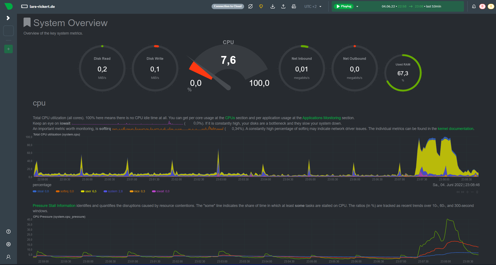

# Server monitoring

This example creates a [netdata](https://hub.docker.com/r/netdata/netdata) server monitoring application. You get insights about your CPU and ram usage and more. It also shows metrics for all docker containers individually.



::: warning Make the example your own
In general you don't have to change anything in the below example to make it work for you. However, we highly recommend to take a closer look to the lines marked with a `TODO: CHANGE ME` comment.
:::

## Installation

### Step 1: Create a `docker-compose.yml` file

```yaml
version: "3"

services:
  netdata:
    image: netdata/netdata:v1.37
    hostname: "${HOST_FQDN}"
    restart: always
    cap_add:
      - SYS_PTRACE
    security_opt:
      - apparmor:unconfined
    volumes:
      - netdataconfig:/etc/netdata
      - netdatalib:/var/lib/netdata
      - netdatacache:/var/cache/netdata
      - /proc:/host/proc:ro
      - /sys:/host/sys:ro
      - /etc/os-release:/host/etc/os-release:ro
    environment:
      VIRTUALIZATION: "${VIRTUALIZATION}"
      DISABLE_TELEMETRY: 1
      DOCKER_HOST: proxy:2375
      VIRTUAL_HOST: "${DOMAIN?:}"
      LETSENCRYPT_HOST: "${DOMAIN?:}"
    networks:
      - default
      - nginx-proxy

  # proxy for host docker socket (more secure than mounting directly to netdata service)
  proxy:
    image: tecnativa/docker-socket-proxy:0.1
    restart: always
    environment:
      CONTAINERS: 1
    volumes:
      - /var/run/docker.sock:/var/run/docker.sock:ro

volumes:
  netdataconfig:
  netdatalib:
  netdatacache:

networks:
  default:
  nginx-proxy:
    external: true
```

### Step 2: Create a `.env` file

```apache
# Domain that the application should be deployed to
# TODO: CHANGE ME:
DOMAIN=monitoring.example.com

# FQDN (full qualified domain name) of the DOMAIN above
# It is e.g. displayed in the browser tab and application menu
# TODO: CHANGE ME:
HOST_FQDN=example.com

# check virtualization on your host system with "systemd-detect-virt -v"
# leave empty if you have no virtualization. Needed for correct monitoring
# TODO: CHANGE ME:
VIRTUALIZATION=

```

### Step 3: Start the application

```bash
docker-compose up -d
```

## Basic authentication

Since the monitoring application provides sensible data about your server, you should protect it with basic authentication (username + password). You can follow our [basic authentication guide](/guide/basic-authentication) for this.
