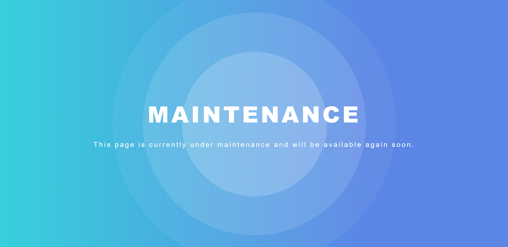

# Static site

This example creates an application for static files (e.g. serving plain files or Vue/React/Angular application).

::: info Make the example your own
In general you don't have to change anything in the below example to make it work for you. However, we highly recommend to take a closer look to the lines marked with a `TODO: CHANGE ME` comment.
:::

## Static files

This example serves static files from a local directory on your linux server.

- **Step 1:** Create a `docker-compose.yml` file.

```yaml
version: "3"

services:
  app:
    image: nginx:stable-alpine
    restart: always
    environment:
      VIRTUAL_HOST: "${DOMAIN}"
      LETSENCRYPT_HOST: "${DOMAIN}"
    volumes:
      # TODO: CHANGE ME: change ./html to the path to your files
      - ./html:/usr/share/nginx/html
      - ./nginx.conf:/etc/nginx/nginx.conf

networks:
  default:
    name: nginx-proxy
    external: true
```

- **Step 2:** Create a `.env` file.

```apache
# Domain that the application should be deployed to
# TODO: CHANGE ME:
DOMAIN=static.example.de
```

- **Step 3:** Create a `nginx.conf` file.

The `nginx.conf` file is needed to redirect all unknown URLs to `/` which is the expected behavior for single page applications (SPAs) like a Vue/React/Angular app. It also enables gzip compression to speed the serving of your files.

```apache
user nginx;
worker_processes auto;

error_log /var/log/nginx/error.log warn;
pid /var/run/nginx.pid;

events {
  worker_connections 1024;
}

http {
  include /etc/nginx/mime.types;
  default_type application/octet-stream;

  log_format main '$remote_addr - $remote_user [$time_local] "$request" '
  '$status $body_bytes_sent "$http_referer" '
  '"$http_user_agent" "$http_x_forwarded_for"';

  access_log /var/log/nginx/access.log main;
  sendfile on;
  keepalive_timeout 65;

  # CUSTOM CONFIG
  # This is how we host our static site.
  server {
    listen 80;
    server_name localhost;

    location / {

      # Enable gzip. NOTE: text/html files are always gzipped when enabled
      gzip on;
      gzip_min_length 1000;
      gzip_types text/plain text/css application/javascript application/json image/x-icon;

      # The location of the static files to server, must match path defined in Dockerfile
      root /usr/share/nginx/html;

      # Remove trailing slashes. /about/ -> /about
      # This is important because of how static files are generated.
      rewrite ^/(.*)/$ /$1 permanent;

      # config for SPAs do redirect 404 to index.html
      try_files $uri /index.html;
    }
  }
}
```

- **Step 4:** Start the application.

```bash
docker-compose up -d
```

- **Step 5 (optional):** Create dummy content.

Inside `./html` folder, create `index.html` file with the following content:

```html
<!DOCTYPE html>
<html lang="en">
  <head>
    <meta charset="UTF-8" />
    <meta http-equiv="X-UA-Compatible" content="IE=edge" />
    <meta name="viewport" content="width=device-width, initial-scale=1.0" />
    <title>Dummy site</title>
  </head>

  <body>
    <p>I am static content served by the nginx-proxy.</p>
  </body>
</html>
```

## Example maintenance page

[Here](../assets/example-static-maintenance-page.zip) you can download a simple example website for a cool looking maintenance page. Copy the downloaded files to the directory that you mounted in step 1.



## Vue/React/Angular app

You can just copy your static build files of your Vue/React/Angular app the the directory mounted in step 1. But we recommend to build your own standalone docker image using a Dockerfile:

- **Step 1:** Create a `Dockerfile` file.

```dockerfile
# build stage
FROM node:17-alpine as build
WORKDIR /app
COPY package*.json ./
RUN npm ci

COPY . ./
RUN npm run build

# production stage
FROM nginx:stable-alpine
COPY --from=build /app/dist /usr/share/nginx/html
# this is the nginx.conf that we created in step 3
COPY nginx.conf /etc/nginx/nginx.conf
EXPOSE 80
CMD ["nginx", "-g", "daemon off;"]
```

- **Step 3:** Change `docker-compose.yml` file.

```yaml
version: "3"

services:
  app:
    # TODO: CHANGE ME: Path to directory that your Dockerfile is in
    build: .
    image: larsrickert/nginx-proxy-example-static
    restart: always
    environment:
      VIRTUAL_HOST: "${DOMAIN}"
      LETSENCRYPT_HOST: "${DOMAIN}"

networks:
  default:
    name: nginx-proxy
    external: true
```
